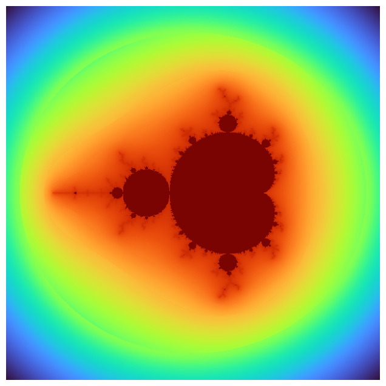

# fractalart


<!-- WARNING: THIS FILE WAS AUTOGENERATED! DO NOT EDIT! -->

This file will become your README and also the index of your
documentation.

## Developer Guide

If you are new to using `nbdev` here are some useful pointers to get you
started.

### Install fractalart in Development mode

``` sh
# make sure fractalart package is installed in development mode
$ pip install -e .

# make changes under nbs/ directory
# ...

# compile to have changes apply to fractalart
$ nbdev_prepare
```

## Usage

### Installation

Install latest from the GitHub
[repository](https://github.com/eandreas/fractalart):

``` sh
$ pip install git+https://github.com/eandreas/fractalart.git
```

or from [conda](https://anaconda.org/eandreas/fractalart)

``` sh
$ conda install -c eandreas fractalart
```

or from [pypi](https://pypi.org/project/fractalart/)

``` sh
$ pip install fractalart
```

### Documentation

Documentation can be found hosted on this GitHub
[repository](https://github.com/eandreas/fractalart)’s
[pages](https://eandreas.github.io/fractalart/). Additionally you can
find package manager specific guidelines on
[conda](https://anaconda.org/eandreas/fractalart) and
[pypi](https://pypi.org/project/fractalart/) respectively.

## How to use

Fill me in please! Don’t forget code examples:

``` python
1+1
```

    2

``` python
m = Mandelbrot()
m.render()
m.equalize_histogram()
m.plot()
```

    OMP: Info #276: omp_set_nested routine deprecated, please use omp_set_max_active_levels instead.


