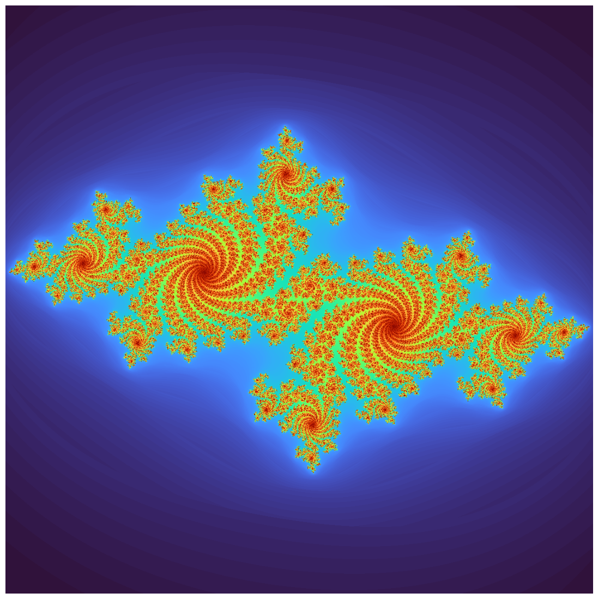
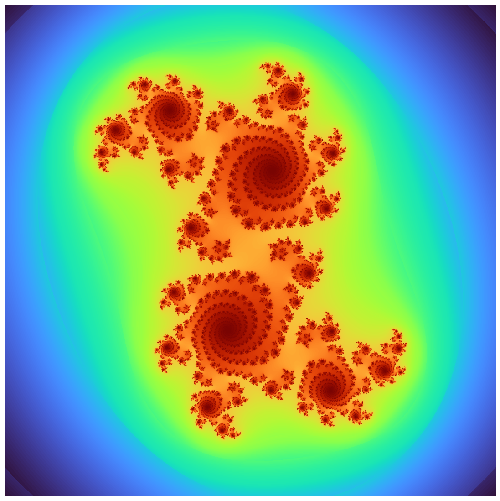
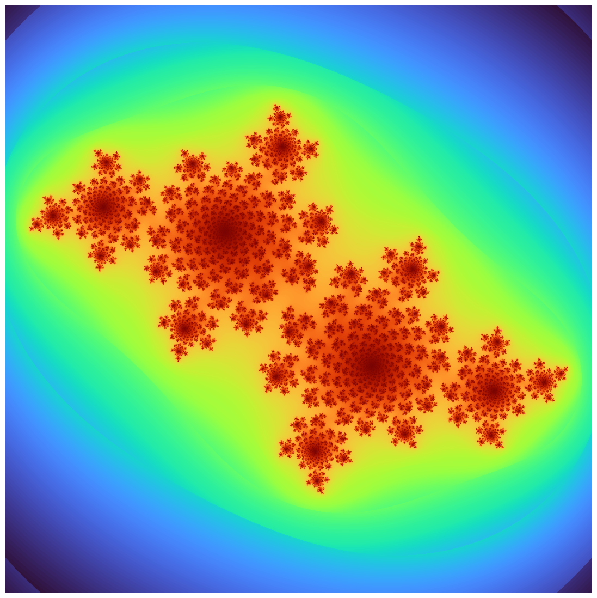
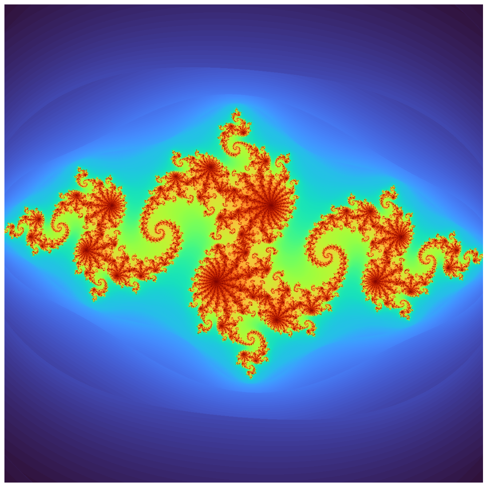
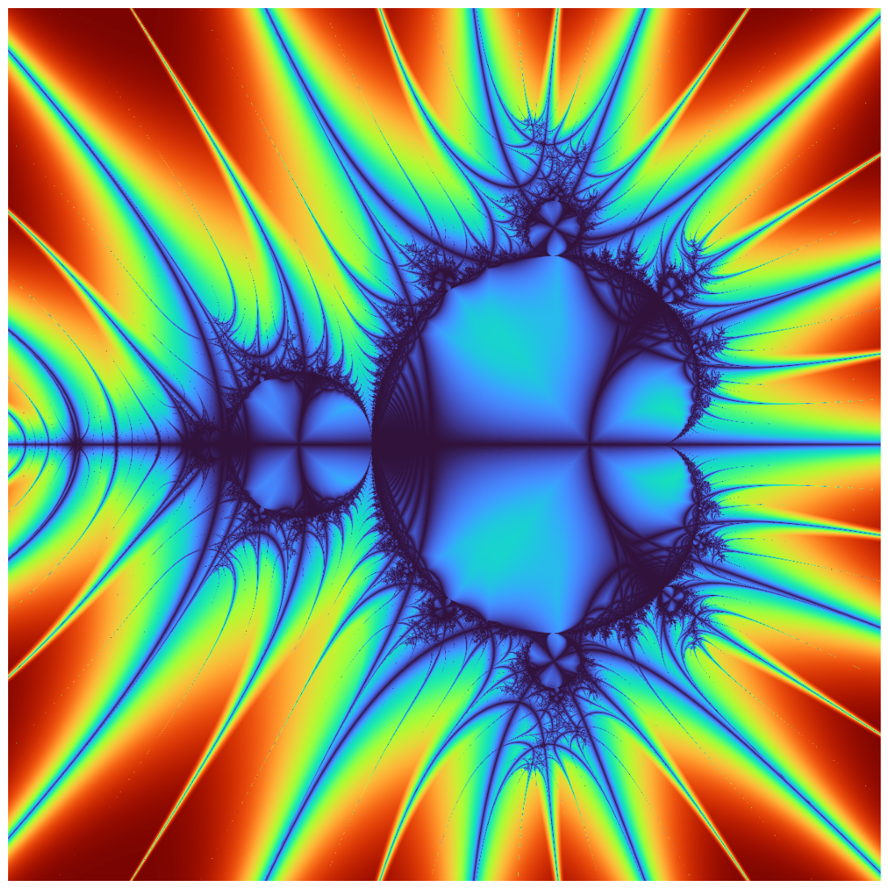
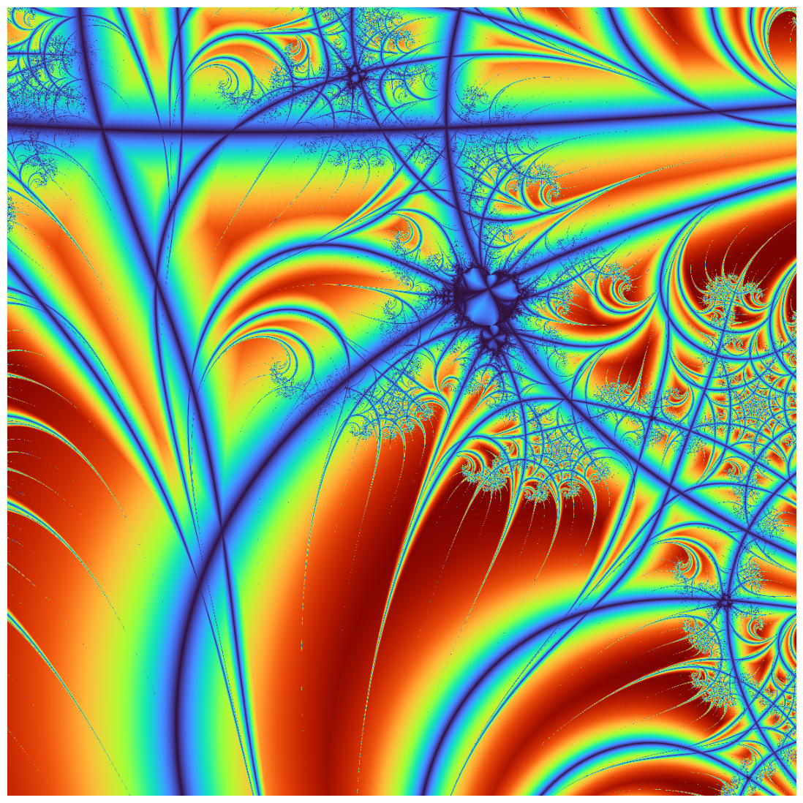

# fractal


<!-- WARNING: THIS FILE WAS AUTOGENERATED! DO NOT EDIT! -->

------------------------------------------------------------------------

<a
href="https://github.com/eandreas/fractalart/blob/main/fractalart/fractal.py#L17"
target="_blank" style="float:right; font-size:smaller">source</a>

### Fractal

>  Fractal (width:int=800, height:int=800, x_min:float=-2.0,
>               x_max:float=1.0, y_min:float=-1.5, y_max:float=1.5,
>               max_iter:int=1000)

*Abstract base class for generating fractal images.*

------------------------------------------------------------------------

<a
href="https://github.com/eandreas/fractalart/blob/main/fractalart/fractal.py#L139"
target="_blank" style="float:right; font-size:smaller">source</a>

### Mandelbrot

>  Mandelbrot (width:int=800, height:int=800, x_min:float=-2.0,
>                  x_max:float=1.0, y_min:float=-1.5, y_max:float=1.5,
>                  max_iter:int=1000)

*Abstract base class for generating fractal images.*

------------------------------------------------------------------------

<a
href="https://github.com/eandreas/fractalart/blob/main/fractalart/fractal.py#L176"
target="_blank" style="float:right; font-size:smaller">source</a>

### Julia

>  Julia (cr:float, ci:float, width:int=800, height:int=800,
>             x_min:float=-1.5, x_max:float=1.5, y_min:float=-1.5,
>             y_max:float=1.5, max_iter:int=1000)

*Abstract base class for generating fractal images.*

<table>
<thead>
<tr>
<th></th>
<th><strong>Type</strong></th>
<th><strong>Default</strong></th>
<th><strong>Details</strong></th>
</tr>
</thead>
<tbody>
<tr>
<td>cr</td>
<td>float</td>
<td></td>
<td></td>
</tr>
<tr>
<td>ci</td>
<td>float</td>
<td></td>
<td></td>
</tr>
<tr>
<td>width</td>
<td>int</td>
<td>800</td>
<td></td>
</tr>
<tr>
<td>height</td>
<td>int</td>
<td>800</td>
<td></td>
</tr>
<tr>
<td>x_min</td>
<td>float</td>
<td>-1.5</td>
<td>override Fractal default</td>
</tr>
<tr>
<td>x_max</td>
<td>float</td>
<td>1.5</td>
<td>override Fractal default</td>
</tr>
<tr>
<td>y_min</td>
<td>float</td>
<td>-1.5</td>
<td>keep same (or change)</td>
</tr>
<tr>
<td>y_max</td>
<td>float</td>
<td>1.5</td>
<td>keep same (or change)</td>
</tr>
<tr>
<td>max_iter</td>
<td>int</td>
<td>1000</td>
<td>keep same (or change)</td>
</tr>
</tbody>
</table>

``` python
j = Julia(cr = -0.7, ci = 0.27015)
j.resolution = 1200, 1200
j.max_iter = 3000
j.render()
j.equalize_histogram()
j.plot()
```



``` python
j = Julia(cr = 0.355, ci = 0.355)
j.resolution = 1200, 1200
j.max_iter = 3000
j.render()
j.equalize_histogram()
j.plot()
```



``` python
j = Julia(cr = -0.4, ci = 0.6)
j.resolution = 1200, 1200
j.max_iter = 3000
j.render()
j.equalize_histogram()
j.plot()
```



``` python
j = Julia(cr = -0.8, ci = 0.156)
j.resolution = 1200, 1200
j.max_iter = 3000
j.render()
j.equalize_histogram()
j.plot()
```



``` python
m = Mandelbrot()
m.resolution = 1200, 1200
m.max_iter = 3000
m.render()
m.equalize_histogram()
m.plot()
```



``` python
m = Mandelbrot()
m.resolution = 1200, 1200
m.max_iter = 3000

#m.set_zoom(5, (-0.170337,-1.06506))
#m.set_zoom(25, (-0.170337,-1.06506))
#m.set_zoom(125, (-0.170337,-1.06506))
#m.set_zoom(625, (-0.170337,-1.06506))
#m.set_zoom(3125, (-0.170337,-1.06506))
#m.set_zoom(15625, (-0.170337,-1.06506))
#m.set_zoom(78125, (-0.170337,-1.06506))

#m.set_zoom(5, (0.42884,-0.231345))
#m.set_zoom(25, (0.42884,-0.231345))
m.set_zoom(125, (0.42884,-0.231345))
#m.set_zoom(625, (0.42884,-0.231345))
#m.set_zoom(3125, (0.42884,-0.231345))
#m.set_zoom(15625, (0.42884,-0.231345))
#m.set_zoom(78125, (0.42884,-0.231345))

#m.set_zoom(5, (-1.62917,-0.0203968))
#m.set_zoom(25, (-1.62917,-0.0203968))
#m.set_zoom(125, (-1.62917,-0.0203968))
#m.set_zoom(625, (-1.62917,-0.0203968))
#m.set_zoom(3125, (-1.62917,-0.0203968))
#m.set_zoom(15625, (-1.62917,-0.0203968))
#m.set_zoom(78125, (-1.62917,-0.0203968))

#m.set_zoom(5, (-0.761574,-0.0847596))
#m.set_zoom(25, (-0.761574,-0.0847596))
#m.set_zoom(125, (-0.761574,-0.0847596))
#m.set_zoom(625, (-0.761574,-0.0847596))
#m.set_zoom(3125, (-0.761574,-0.0847596))
#m.set_zoom(15625, (-0.761574,-0.0847596))
#m.set_zoom(78125, (-0.761574,-0.0847596))

m.render()
m.equalize_histogram()
m.plot()
```



``` python
class Mandelbrot(Fractal):
    def compute(self) -> np.ndarray:
        w, h = self.resolution
        # pass resolution-consistent dims
        return _compute_mandelbrot_set(self._x_min, self._x_max, self._y_min, self._y_max, w, h, self._max_iter)
```
