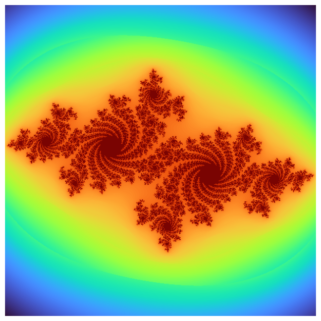

# julia


<!-- WARNING: THIS FILE WAS AUTOGENERATED! DO NOT EDIT! -->

------------------------------------------------------------------------

<a
href="https://github.com/eandreas/fractalart/blob/main/fractalart/fractal.py#L200"
target="_blank" style="float:right; font-size:smaller">source</a>

### julia_step

>  julia_step (zr, zi, cr, ci)

------------------------------------------------------------------------

<a
href="https://github.com/eandreas/fractalart/blob/main/fractalart/fractal.py#L120"
target="_blank" style="float:right; font-size:smaller">source</a>

### smooth_coloring

>  smooth_coloring (zr, zi, iteration)

``` python
class Julia(Fractal):
    def __init__(
        self,
        x_min: float = None,
        x_max: float =  None,
        y_min: float = None,
        y_max: float =  None,
        cr: float = -0.7,
        ci: float = 0.27015,
        width: int = 600,
        height: int = 600,
        max_iter: int = 200,
    ):
        if None in (x_min, x_max, y_min, y_max):
            x_min, x_max, y_min, y_max = -1.5, 1.5, -1.5, 1.5
        self._x_min, self._x_max = x_min, x_max
        self._y_min, self._y_max = y_min, y_max
        self.resolution = width, height
        self.max_iter = max_iter
        self._cr = cr
        self._ci = ci
        
    def compute(self) -> np.ndarray:
        return _compute_julia(self._x_min, self._x_max, self._y_min, self._y_max, self._cr, self._ci, 
                                self.resolution, self._max_iter, julia_step)
```

``` python
j = Julia()
j.render()
j.equalize_histogram()
j.plot()
```

    OMP: Info #276: omp_set_nested routine deprecated, please use omp_set_max_active_levels instead.


