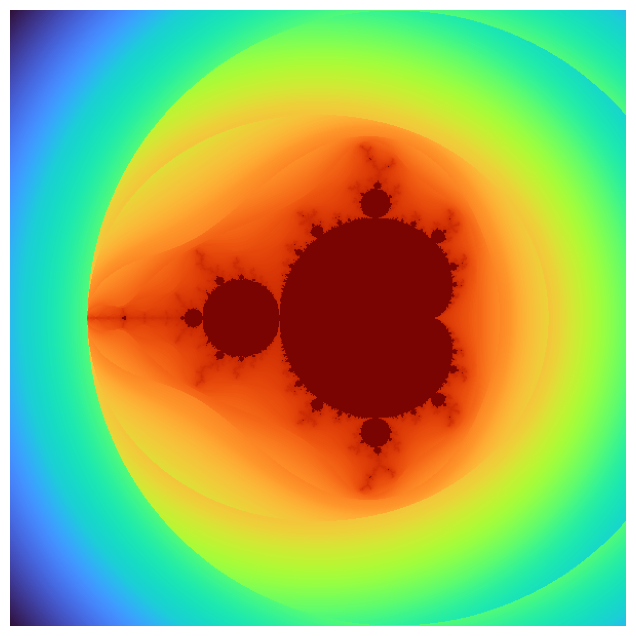
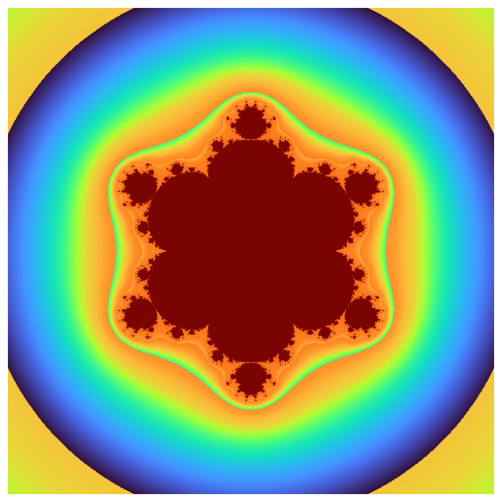

# mandelbrot


<!-- WARNING: THIS FILE WAS AUTOGENERATED! DO NOT EDIT! -->

------------------------------------------------------------------------

<a
href="https://github.com/eandreas/fractalart/blob/main/fractalart/fractal.py#L187"
target="_blank" style="float:right; font-size:smaller">source</a>

### mandelbrot_step

>  mandelbrot_step (zr, zi, cr, ci, n)

------------------------------------------------------------------------

<a
href="https://github.com/eandreas/fractalart/blob/main/fractalart/fractal.py#L180"
target="_blank" style="float:right; font-size:smaller">source</a>

### mandelbrot_step_n

>  mandelbrot_step_n (zr, zi, cr, ci, n)

------------------------------------------------------------------------

<a
href="https://github.com/eandreas/fractalart/blob/main/fractalart/fractal.py#L162"
target="_blank" style="float:right; font-size:smaller">source</a>

### mandelbrot_step_5

>  mandelbrot_step_5 (zr, zi, cr, ci)

------------------------------------------------------------------------

<a
href="https://github.com/eandreas/fractalart/blob/main/fractalart/fractal.py#L151"
target="_blank" style="float:right; font-size:smaller">source</a>

### mandelbrot_step_4

>  mandelbrot_step_4 (zr, zi, cr, ci)

------------------------------------------------------------------------

<a
href="https://github.com/eandreas/fractalart/blob/main/fractalart/fractal.py#L141"
target="_blank" style="float:right; font-size:smaller">source</a>

### mandelbrot_step_3

>  mandelbrot_step_3 (zr, zi, cr, ci)

------------------------------------------------------------------------

<a
href="https://github.com/eandreas/fractalart/blob/main/fractalart/fractal.py#L133"
target="_blank" style="float:right; font-size:smaller">source</a>

### mandelbrot_step_1

>  mandelbrot_step_1 (zr, zi, cr, ci)

------------------------------------------------------------------------

<a
href="https://github.com/eandreas/fractalart/blob/main/fractalart/fractal.py#L120"
target="_blank" style="float:right; font-size:smaller">source</a>

### smooth_coloring

>  smooth_coloring (zr, zi, iteration)

------------------------------------------------------------------------

<a
href="https://github.com/eandreas/fractalart/blob/main/fractalart/fractal.py#L307"
target="_blank" style="float:right; font-size:smaller">source</a>

### Mandelbrot

>  Mandelbrot (x_min:float=None, x_max:float=None, y_min:float=None,
>                  y_max:float=None, width:int=600, height:int=600,
>                  max_iter:int=200, order:int=2)

*Abstract base class for generating fractal images.*

``` python
m = Mandelbrot()
a = m.render()
m.equalize_histogram()
m.plot()
```



``` python
m = Mandelbrot(order=7)
a = m.render()
m.equalize_histogram()
m.plot()
```


