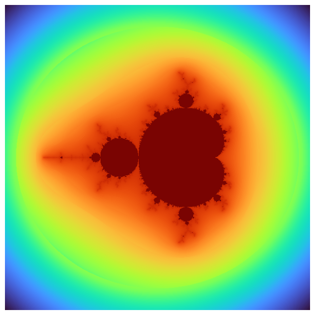
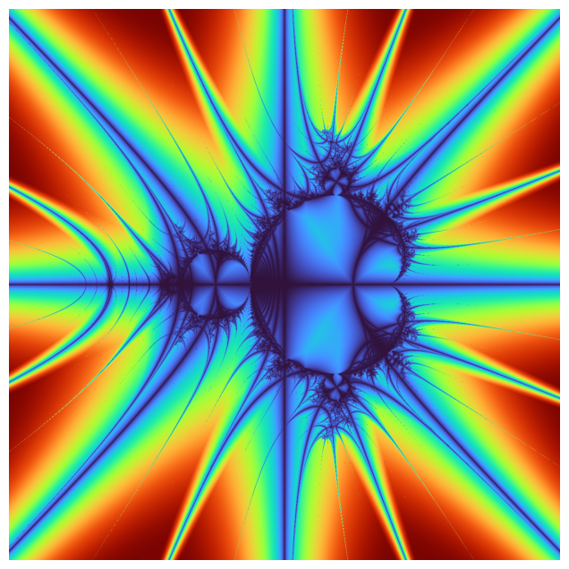
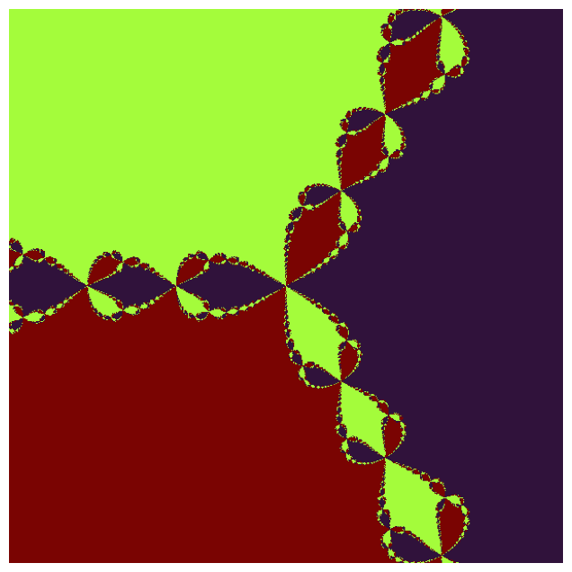

# newton


<!-- WARNING: THIS FILE WAS AUTOGENERATED! DO NOT EDIT! -->

------------------------------------------------------------------------

<a
href="https://github.com/eandreas/fractalart/blob/main/fractalart/fractal.py#L19"
target="_blank" style="float:right; font-size:smaller">source</a>

### Fractal

>  Fractal (width:int=1200, height:int=1200)

*Abstract base class for generating fractal images.*

------------------------------------------------------------------------

<a
href="https://github.com/eandreas/fractalart/blob/main/fractalart/fractal.py#L297"
target="_blank" style="float:right; font-size:smaller">source</a>

### compute_roots_of_unity

>  compute_roots_of_unity (order)

------------------------------------------------------------------------

<a
href="https://github.com/eandreas/fractalart/blob/main/fractalart/fractal.py#L270"
target="_blank" style="float:right; font-size:smaller">source</a>

### newton_derivative_fn

>  newton_derivative_fn (zr, zi, cr, ci, order)

*Compute f’(z) = order * z^(order - 1) where z = zr + i zi

Returns: (dr, di) real and imaginary parts of f’(z)\*

------------------------------------------------------------------------

<a
href="https://github.com/eandreas/fractalart/blob/main/fractalart/fractal.py#L246"
target="_blank" style="float:right; font-size:smaller">source</a>

### newton_fn

>  newton_fn (zr, zi, cr, ci, order)

\*Compute f(z) = z^order - 1 where z = zr + i zi

Returns: (fr, fi) real and imaginary parts of f(z)\*

------------------------------------------------------------------------

<a
href="https://github.com/eandreas/fractalart/blob/main/fractalart/fractal.py#L208"
target="_blank" style="float:right; font-size:smaller">source</a>

### newton_step

>  newton_step (zr, zi, cr, ci, order, fractal_fn, fractal_derivative_fn)

*Perform one Newton iteration step on complex z = zr + i*zi: z_next =
z - f(z) / f’(z)

Parameters: zr, zi : float - real and imaginary parts of current z cr,
ci : float - parameters (e.g., constants in fractal) order : int - order
of fractal fractal_fn : function - f(z), returns (fr, fi)
fractal_derivative_fn : function - f’(z), returns (dr, di)

Returns: (zr_next, zi_next): next iteration complex number\*

------------------------------------------------------------------------

<a
href="https://github.com/eandreas/fractalart/blob/main/fractalart/fractal.py#L204"
target="_blank" style="float:right; font-size:smaller">source</a>

### cross_dist

>  cross_dist (zr:float, zi:float)

------------------------------------------------------------------------

<a
href="https://github.com/eandreas/fractalart/blob/main/fractalart/fractal.py#L200"
target="_blank" style="float:right; font-size:smaller">source</a>

### julia_step

>  julia_step (zr, zi, cr, ci)

------------------------------------------------------------------------

<a
href="https://github.com/eandreas/fractalart/blob/main/fractalart/fractal.py#L187"
target="_blank" style="float:right; font-size:smaller">source</a>

### mandelbrot_step

>  mandelbrot_step (zr, zi, cr, ci, n)

------------------------------------------------------------------------

<a
href="https://github.com/eandreas/fractalart/blob/main/fractalart/fractal.py#L180"
target="_blank" style="float:right; font-size:smaller">source</a>

### mandelbrot_step_n

>  mandelbrot_step_n (zr, zi, cr, ci, n)

------------------------------------------------------------------------

<a
href="https://github.com/eandreas/fractalart/blob/main/fractalart/fractal.py#L162"
target="_blank" style="float:right; font-size:smaller">source</a>

### mandelbrot_step_5

>  mandelbrot_step_5 (zr, zi, cr, ci)

------------------------------------------------------------------------

<a
href="https://github.com/eandreas/fractalart/blob/main/fractalart/fractal.py#L151"
target="_blank" style="float:right; font-size:smaller">source</a>

### mandelbrot_step_4

>  mandelbrot_step_4 (zr, zi, cr, ci)

------------------------------------------------------------------------

<a
href="https://github.com/eandreas/fractalart/blob/main/fractalart/fractal.py#L141"
target="_blank" style="float:right; font-size:smaller">source</a>

### mandelbrot_step_3

>  mandelbrot_step_3 (zr, zi, cr, ci)

------------------------------------------------------------------------

<a
href="https://github.com/eandreas/fractalart/blob/main/fractalart/fractal.py#L133"
target="_blank" style="float:right; font-size:smaller">source</a>

### mandelbrot_step_1

>  mandelbrot_step_1 (zr, zi, cr, ci)

------------------------------------------------------------------------

<a
href="https://github.com/eandreas/fractalart/blob/main/fractalart/fractal.py#L120"
target="_blank" style="float:right; font-size:smaller">source</a>

### smooth_coloring

>  smooth_coloring (zr, zi, iteration)

------------------------------------------------------------------------

<a
href="https://github.com/eandreas/fractalart/blob/main/fractalart/fractal.py#L307"
target="_blank" style="float:right; font-size:smaller">source</a>

### Mandelbrot

>  Mandelbrot (x_min:float=-2.5, x_max:float=1.5, y_min:float=-2.0,
>                  y_max:float=2.0, width:int=600, height:int=600,
>                  max_iter:int=200, order:int=2)

*Abstract base class for generating fractal images.*

``` python
m = Mandelbrot(order=2)
m.resolution = 600, 600
m.max_iter = 200
a = m.render()
m.equalize_histogram()
m.plot()
```

    OMP: Info #276: omp_set_nested routine deprecated, please use omp_set_max_active_levels instead.



------------------------------------------------------------------------

<a
href="https://github.com/eandreas/fractalart/blob/main/fractalart/fractal.py#L370"
target="_blank" style="float:right; font-size:smaller">source</a>

### MandelbrotCrossTrap

>  MandelbrotCrossTrap (x_min:float=-2.5, x_max:float=1.5, y_min:float=-2.0,
>                           y_max:float=2.0, width:int=600, height:int=600,
>                           max_iter:int=200, order:int=2)

*Abstract base class for generating fractal images.*

``` python
m = MandelbrotCrossTrap(order=2)
m.resolution = 1200, 1200
m.max_iter = 200
m.render()
m.equalize_histogram()
m.plot()
```



``` python
@njit(parallel=True)
def _compute_newton(x_min, x_max, y_min, y_max, resolution, max_iter, order, fractal_fn, fractal_derivative_fn):
    width, height = resolution
    result = np.zeros((height, width), dtype=np.int32)
    dx = (x_max - x_min) / (width - 1)
    dy = (y_max - y_min) / (height - 1)

    roots_real, roots_imag = compute_roots_of_unity(order)

    for j in prange(height):
        zy = y_min + j * dy
        for i in range(width):
            zx = x_min + i * dx
            zr, zi = zx, zy
            converged = False
            for iteration in range(max_iter):
                # fractal_fn and fractal_derivative_fn assumed njit and defined elsewhere
                fr, fi = fractal_fn(zr, zi, 0.0, 0.0, order)
                dr, di = fractal_derivative_fn(zr, zi, 0.0, 0.0, order)

                denom = dr*dr + di*di
                if denom == 0.0:
                    break

                real_part = (fr*dr + fi*di) / denom
                imag_part = (fi*dr - fr*di) / denom

                zr -= real_part
                zi -= imag_part

                # Check convergence to any root
                for root_index in range(order):
                    dist = (zr - roots_real[root_index])**2 + (zi - roots_imag[root_index])**2
                    if dist < 1e-6:
                        result[j, i] = root_index + 1
                        converged = True
                        break

                if converged:
                    break

    return result
```

------------------------------------------------------------------------

<a
href="https://github.com/eandreas/fractalart/blob/main/fractalart/fractal.py#L395"
target="_blank" style="float:right; font-size:smaller">source</a>

### Newton

>  Newton (x_min:float=-2.0, x_max:float=2.0, y_min:float=-2.0,
>              y_max:float=2.0, width:int=600, height:int=600, max_iter:int=200,
>              order:int=3)

*Abstract base class for generating fractal images.*

``` python
fractal = Newton()
fractal.render()
#fractal.equalize_histogram()
fractal.plot()
```



``` python
##| export
#@njit(parallel=True, fastmath=True)
#def _compute_mandelbrot(x_min: float, x_max: float, y_min: float, y_max: float, width: int, height: int, max_iter: int) -> np.ndarray:
#    # Allocate with float32 to halve memory bandwidth (optional)
#    result = np.zeros((height, width), dtype=np.float32)
#
#    dx = (x_max - x_min) / (width - 1)
#    dy = (y_max - y_min) / (height - 1)
#
#    inv_log2 = 1.0 / math.log(2.0)   # for nu calculation
#    r2_cut = max(abs(x_max), abs(x_min)) * max(abs(x_max), abs(x_min)) + max(abs(y_max), abs(y_min)) * max(abs(y_max), abs(y_min))
#
#    for j in prange(height):
#        zy = y_min + j * dy
#        for i in range(width):
#            zx = x_min + i * dx
#            zr = 0.0
#            zi = 0.0
#            cr = zx
#            ci = zy
#            iteration = 0
#
#            # Mandelbrot iteration
#            while zr * zr + zi * zi <= r2_cut and iteration < max_iter:
#                # TODO : use zr * zr + zi * zi <= 4 and iteration < max_iter for classical fractal calculation without orbit traps
#                # (zr + i zi)^2 + c
#                zr2 = zr * zr - zi * zi + cr
#                zi = 2.0 * zr * zi + ci
#                zr = zr2
#                iteration += 1
#
#            if iteration < max_iter:
#                mag_sq = zr * zr + zi * zi
#                if mag_sq > 0.0:
#                    log_zn = 0.5 * math.log(mag_sq)
#                    if log_zn > 0.0:
#                        nu = math.log(log_zn * inv_log2) * inv_log2
#                        result[j, i] = iteration + 1 - nu
#                    else:
#                        result[j, i] = iteration
#                else:
#                    result[j, i] = iteration
#            else:
#                result[j, i] = iteration
#
#    return result
#
#class Mandelbrot(Fractal):
#    def compute(self) -> np.ndarray:
#        w, h = self.resolution
#        # pass resolution-consistent dims
#        return _compute_mandelbrot(self._x_min, self._x_max, self._y_min, self._y_max, w, h, self._max_iter)
```

``` python
##| export
#@njit(parallel=True, fastmath=True)
#def _compute_mandelbrot_cross_trap(x_min: float, x_max: float, y_min: float, y_max: float, width: int, height: int, max_iter: int) -> np.ndarray:
#    # Allocate with float32 to halve memory bandwidth (optional)
#    cross_trap = np.zeros((height, width), dtype=np.float32)
#
#    dx = (x_max - x_min) / (width - 1)
#    dy = (y_max - y_min) / (height - 1)
#
#    inv_log2 = 1.0 / math.log(2.0)   # for nu calculation
#
#    for j in prange(height):
#        zy = y_min + j * dy
#        for i in range(width):
#            zx = x_min + i * dx
#            zr = 0.0
#            zi = 0.0
#            cr = zx
#            ci = zy
#            iteration = 0
#            min_cross = 1e10
#
#            # Mandelbrot iteration
#            while iteration < max_iter:
#                # TODO : use zr * zr + zi * zi <= 4 and iteration < max_iter for classical fractal calculation without orbit traps
#                # (zr + i zi)^2 + c
#                zr2 = zr * zr - zi * zi + cr
#                zi = 2.0 * zr * zi + ci
#                zr = zr2
#                iteration += 1
#
#                # Cross trap: distance to real or imaginary axis
#                # TOTO : only take the min after a specific number of iterations , e. g. iteration > 3:
#                if iteration > 2:
#                    cross_dist = min(abs(zr), abs(zi))
#                    if (cross_dist < min_cross):
#                        min_cross = cross_dist
#
#            cross_trap[j, i] = min_cross
#
#    return cross_trap
#
#class MandelbrotCrossTrap(Fractal):
#    def compute(self) -> np.ndarray:
#        w, h = self.resolution
#        # pass resolution-consistent dims
#        return _compute_mandelbrot_cross_trap(self._x_min, self._x_max, self._y_min, self._y_max, w, h, self._max_iter)
```

``` python
##| export
#@njit(parallel=True, fastmath=True)
#def _compute_julia_set(xmin, xmax, ymin, ymax, width, height, cr, ci, max_iter):
#    dx = (xmax - xmin) / (width - 1)
#    dy = (ymax - ymin) / (height - 1)
#    result = np.zeros((height, width), dtype=np.float32)
#
#    for j in prange(height):
#        y0 = ymin + j * dy
#        for i in range(width):
#            x0 = xmin + i * dx
#            x = x0
#            y = y0
#            iteration = 0
#            while x*x + y*y <= 6.25 and iteration < max_iter:
#                x_temp = x*x - y*y + cr
#                y = 2.0 * x * y + ci
#                x = x_temp
#                iteration += 1
#
#            if iteration < max_iter:
#                # Smooth coloring
#                modulus_sq = x*x + y*y
#                log_zn = np.log(modulus_sq) / 2
#                nu = np.log(log_zn / np.log(2)) / np.log(2)
#                result[j, i] = iteration + 1 - nu
#            else:
#                result[j, i] = max_iter
#
#    return result
#
#class Julia(Fractal):
#    def __init__(
#        self,
#        cr: float = -0.7,
#        ci: float = 0.27015,
#        width: int = 800,
#        height: int = 800,
#        x_min: float = -1.5,   # override Fractal default
#        x_max: float =  1.5,   # override Fractal default
#        y_min: float = -1.5,   # keep same (or change)
#        y_max: float =  1.5,   # keep same (or change)
#        max_iter: int = 1000,  # keep same (or change)
#    ):
#        # 1) initialize the Fractal portion:
#        super().__init__(width, height, x_min, x_max, y_min, y_max, max_iter)
#
#        # 2) store Julia‐specific constants
#        self._cr = cr
#        self._ci = ci
#        
#    def compute(self) -> np.ndarray:
#        w, h = self.resolution
#        # pass resolution-consistent dims
#        return _compute_julia_set(self._x_min, self._x_max, self._y_min, self._y_max, w, h, self._cr, self._ci, self._max_iter)
```

``` python
#j = Julia(cr = -0.7, ci = 0.27015)
#j.resolution = 1200, 1200
#j.max_iter = 3000
#j.render()
#j.equalize_histogram()
#j.plot()
```

``` python
##| export
#@njit(parallel=True, fastmath=True)
#def _compute_julia_cross_trap(xmin, xmax, ymin, ymax, width, height, cr, ci, max_iter):
#    dx = (xmax - xmin) / (width - 1)
#    dy = (ymax - ymin) / (height - 1)
#    cross_trap = np.zeros((height, width), dtype=np.float32)
#
#    for j in prange(height):
#        y0 = ymin + j * dy
#        for i in range(width):
#            x0 = xmin + i * dx
#            x = x0
#            y = y0
#            iteration = 0
#            min_cross = 1e10
#            
#            while iteration < max_iter:
#                x_temp = x*x - y*y + cr
#                y = 2.0 * x * y + ci
#                x = x_temp
#                iteration += 1
#
#                # Cross trap: distance to real or imaginary axis
#                # TOTO : only take the min after a specific number of iterations , e. g. iteration > 3:
#                if iteration > -1:
#                    cross_dist = min(abs(x), abs(y))
#                    if (cross_dist < min_cross):
#                        min_cross = cross_dist
#
#            cross_trap[j, i] = min_cross
#
#    return cross_trap
#
#class JuliaCrossTrap(Fractal):
#    def __init__(
#        self,
#        cr: float = -0.7,
#        ci: float = 0.27015,
#        width: int = 800,
#        height: int = 800,
#        x_min: float = -1.5,   # override Fractal default
#        x_max: float =  1.5,   # override Fractal default
#        y_min: float = -1.5,   # keep same (or change)
#        y_max: float =  1.5,   # keep same (or change)
#        max_iter: int = 1000,  # keep same (or change)
#    ):
#        # 1) initialize the Fractal portion:
#        super().__init__(width, height, x_min, x_max, y_min, y_max, max_iter)
#
#        # 2) store Julia‐specific constants
#        self._cr = cr
#        self._ci = ci
#        
#    def compute(self) -> np.ndarray:
#        w, h = self.resolution
#        # pass resolution-consistent dims
#        return _compute_julia_cross_trap(self._x_min, self._x_max, self._y_min, self._y_max, w, h, self._cr, self._ci, self._max_iter)
```

``` python
#j = JuliaCrossTrap(cr = 0.355, ci = 0.355)
#j.resolution = 1200, 1200
#j.max_iter = 3000
#j.render()
#j.equalize_histogram()
#j.plot()
```

``` python
#j = Julia(cr = -0.4, ci = 0.6)
#j.resolution = 1200, 1200
#j.max_iter = 3000
#j.render()
#j.equalize_histogram()
#j.plot()
```

``` python
#j = Julia(cr = -0.8, ci = 0.156)
#j.resolution = 1200, 1200
#j.max_iter = 3000
#j.render()
#j.equalize_histogram()
#j.plot()
```

``` python
#m = Mandelbrot()
#m.resolution = 1200, 1200
#m.max_iter = 3000
#m.set_zoom(1, (0.0, 0.0))
#m.render()
#m.equalize_histogram()
#m.plot()
```

``` python
#m = MandelbrotCrossTrap()
#m.resolution = 1200, 1200
#m.max_iter = 3000
#m.set_zoom(2, (0.0, 0.0))
#m.render()
#m.equalize_histogram()
#m.plot()
```

``` python
#m = MandelbrotCrossTrap()
#m.resolution = 1200, 1200
#m.max_iter = 3000
#
##m.set_zoom(5, (-0.170337,-1.06506))
##m.set_zoom(25, (-0.170337,-1.06506))
##m.set_zoom(125, (-0.170337,-1.06506))
##m.set_zoom(625, (-0.170337,-1.06506))
##m.set_zoom(3125, (-0.170337,-1.06506))
##m.set_zoom(15625, (-0.170337,-1.06506))
##m.set_zoom(78125, (-0.170337,-1.06506))
#
##m.set_zoom(5, (0.42884,-0.231345))
##m.set_zoom(25, (0.42884,-0.231345))
#m.set_zoom(125, (0.42884,-0.231345))
##m.set_zoom(625, (0.42884,-0.231345))
##m.set_zoom(3125, (0.42884,-0.231345))
##m.set_zoom(15625, (0.42884,-0.231345))
##m.set_zoom(78125, (0.42884,-0.231345))
#
##m.set_zoom(5, (-1.62917,-0.0203968))
##m.set_zoom(25, (-1.62917,-0.0203968))
##m.set_zoom(125, (-1.62917,-0.0203968))
##m.set_zoom(625, (-1.62917,-0.0203968))
##m.set_zoom(3125, (-1.62917,-0.0203968))
##m.set_zoom(15625, (-1.62917,-0.0203968))
##m.set_zoom(78125, (-1.62917,-0.0203968))
#
##m.set_zoom(5, (-0.761574,-0.0847596))
##m.set_zoom(25, (-0.761574,-0.0847596))
##m.set_zoom(125, (-0.761574,-0.0847596))
##m.set_zoom(625, (-0.761574,-0.0847596))
##m.set_zoom(3125, (-0.761574,-0.0847596))
##m.set_zoom(15625, (-0.761574,-0.0847596))
##m.set_zoom(78125, (-0.761574,-0.0847596))
#
#m.render()
#m.equalize_histogram()
#m.plot()
```
